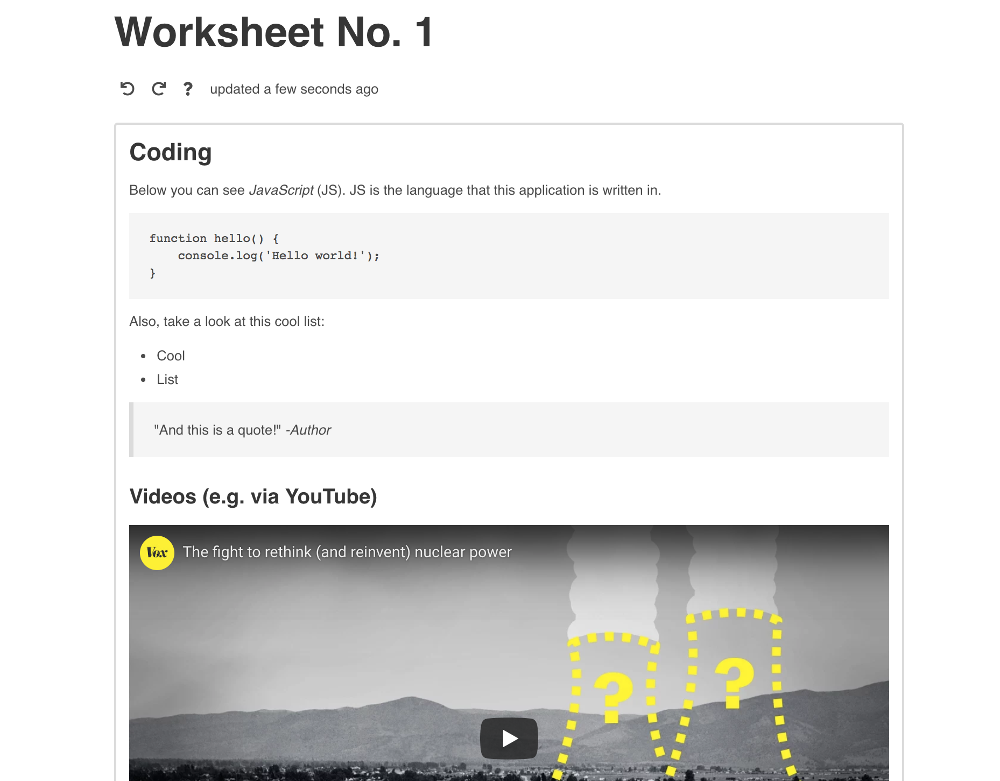

# Edtr.io [](https://github.com/schul-cloud/edtrio/releases) [](https://gitmoji.carloscuesta.me)

<p align="center">
  <a href="#"></a>
</p>

<p align="center">
  A rich text editor for easily creating content in schools based on <a href="https://github.com/edtr-io/edtr-io">edtr-io</a>.
</p>
<br/>



> :rotating_light: Check it out here: https://schul-cloud.github.io/edtrio/

## Getting started

```shell
yarn install
```

```shell
yarn dev
```

## License

The project is licensed under the [MIT License](LICENSE).
